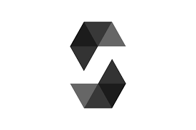

 

  

  <h1 align="center">Notary contract Platform</h1>
  

      Develop a platform that leverages on an ERC20 token that allows to read and update smart contracts created on the platform itself and to save emitted events on a No-SQL database.
  

### Tools

* [Solidity](https://docs.soliditylang.org/en/v0.8.11/)
* [Truffle](https://trufflesuite.com/truffle/)
* [Ganache](https://trufflesuite.com/ganache/)
* [Python](https://www.python.org/)
* [Django](https://www.djangoproject.com/)
* [MongoDB](https://www.mongodb.com/)
* [Redis](https://redis.io/)
* [Web3.py](https://web3py.readthedocs.io/en/stable/)

installa e apri ganache
installa e apri mongod
fai deploy del contratto